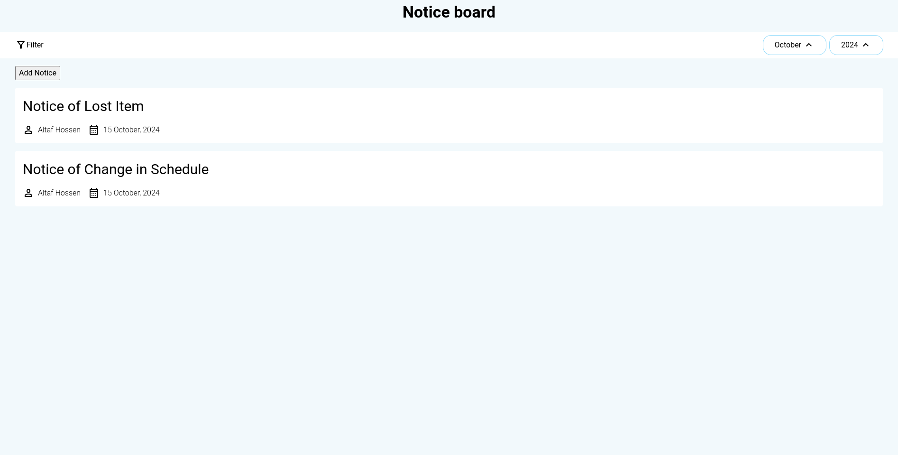
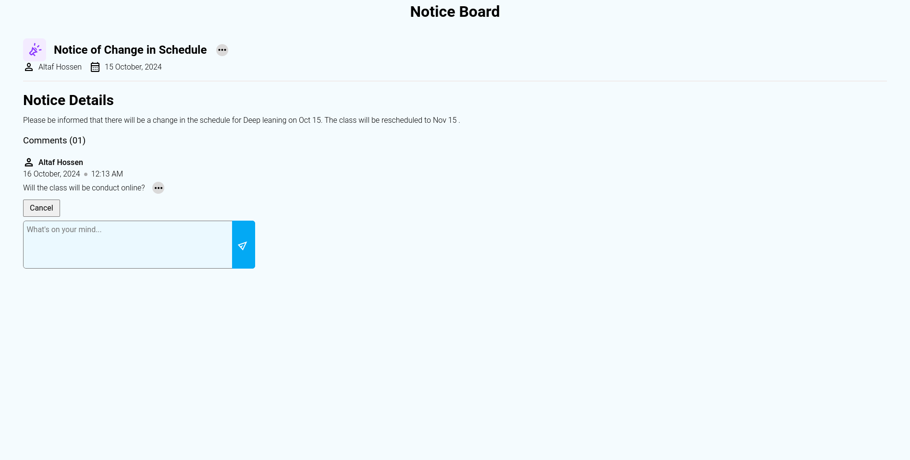
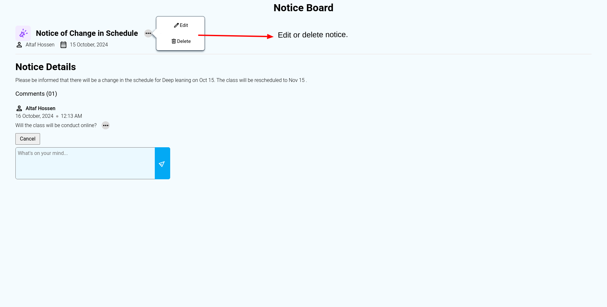
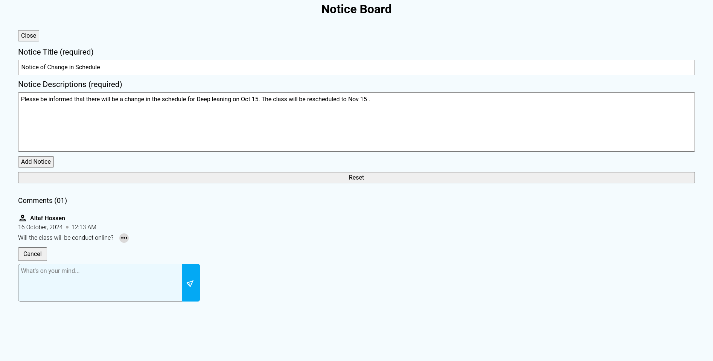
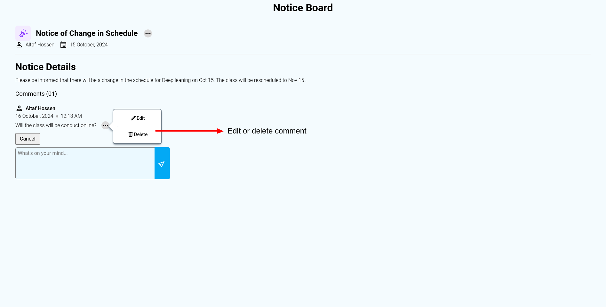
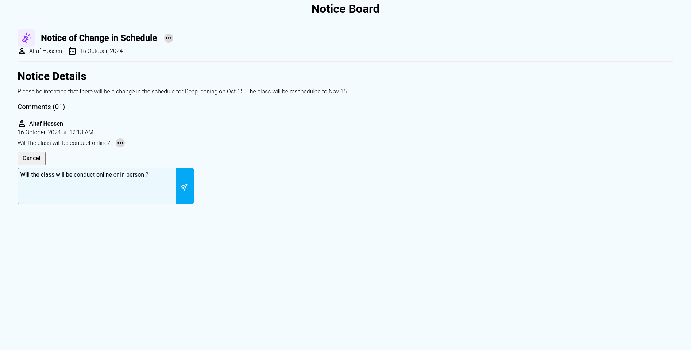

# Project Name

> Our notice board app is your go-to platform for staying connected with your community. Receive timely notifications about events, announcements, and important updates. Easily share information with others and create a vibrant digital noticeboard.
> Live demo [_here_](https://www.example.com)

## Table of Contents

- [General Info](#general-information)
- [Technologies Used](#technologies-used)
- [Features](#features)
- [Screenshots](#screenshots)
- [Setup](#setup)
- [Usage](#usage)
- [Project Status](#project-status)
- [Room for Improvement](#room-for-improvement)
- [Acknowledgements](#acknowledgements)
- [Contact](#contact)

## General Information

This web app will help everyone to stay connected with their community.In our everyday life we came across many situations and we wanted to share them with our loved once.But it is hard to reach everyone individually, so if we can share our message in a common platform from where anyone can acknowledge them.
Then we all will benefit from the web app.

## Technologies Used

- version 1.0

  - **Frontend**:React,React-router
  - **Backend**:Express
  - **Database**:Sqlite3

## Features

- version 1.0

  - User can add notices to the notice board.
  - User can filter notice based on month name and year.
  - User can edit and delete notices.
  - User can see who has commented on their notice.
  - User can edit and delete comments.
  - User can see last edited comments.

## Screenshots










## Setup

- First clone github repo.
- Create a .env file int he backend folder and add PORT = 3000 to it.
- Start express server:

```
    cd backend
    npm install
    npm start
```

- Start react server:

```
    cd frontend
    npm install
    npm run dev
```

## Project Status

Project is: _in progress_ .

## Room for Improvement

Room for improvement:

- Add user based login system.
- Add log section for each user.

To do:

- Add user based login system.

## Acknowledgements

- This project was inspired by the odin project (impowers aspiring web developers to learn together).

- Many thanks to [Asad Mujumder](https://github.com/Asad13).

## Contact

Created by [@ZTanvir](https://github.com/ZTanvir) - feel free to contact me!
