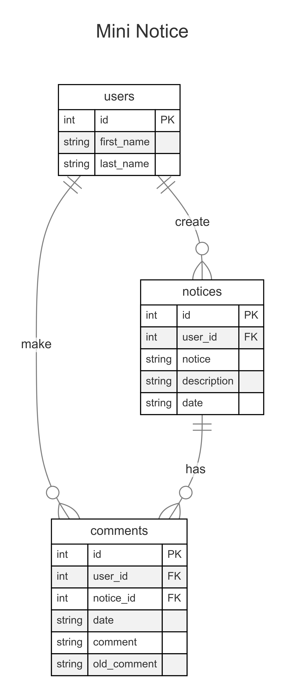

# Mini Message Board

Our notice board app is your go-to platform for staying connected with your community. Receive timely notifications about events, announcements, and important updates. Easily share information with others and create a vibrant digital noticeboard.

## Database

ER diagram for mini message board.

Within noticebord.db you will find the following tables.Click the drop-downs below to learn more about the schema of each individual table.

    
<code>users</code> table

    <code>users</code> table contains the following columns  
    <code>id</code> which is the id of the user  
    <code>first_name</code> which is the first name of the user  
    <code>last_name</code> which is the last name of the user  

    
<code>notices</code> table

    <code>notices</code> table contains the following columns  
    <code>id</code> which is the id of the notice  
    <code>user_id</code> which is the id of the user who created the notice      
    <code>notice</code> which is the description of the notice  
    <code>description</code> which is the description of the notice  
    <code>date</code> which is the date when the notice created 

    
<code>comments</code> table

    <code>comments</code> table contains the following columns  
    <code>id</code> which is the id of the comment  
    <code>notice_id</code> which is the id of the notice where user comments 
    <code>user_id</code> which is the id of the user who comment on the notice 
    <code>date</code> which is the date of the comment 
    <code>comment</code> which is the comment user made 
    <code>old_comment</code> which is the old comment which had been edited  

## Endpoints

REST Resource: notice 
<code>https://url/api</code> 

| Methods |                                                                                                                |
| ------- | -------------------------------------------------------------------------------------------------------------- |
| get     | GET /notice/all Gets information about the id,first_name,last_name,title,date,description for notice           |
| get     | GET /notice/:noticeId Gets notice id,user_id,title,date,description which match the noticeId                   |
| post    | POST /notice/new Create a new notice Send user_id,title,date,description to request body                       |
| put     | Put /notice/:noticeId Update the notice which match the parameter id send id,title,description to request body |
| delete  | Delete /notice/:noticeId Delete the notice which match the parameter id                                        |

 

REST Resource: comment 
<code>https://url/api/notice/:noticeId</code> 

| Methods |                                                                                                                          |
| ------- | ------------------------------------------------------------------------------------------------------------------------ |
| get     | GET /comment/all Gets information about the id,notice_id,first_name,last_name,date,description of the comment            |
| post    | POST /comment/new Create a new comment,send notice_id,user_id,title,date,description to request body                     |
| put     | PUT /comment/:commentId Update the comment which match the parameter commentId send id,title,description to request body |
| delete  | Delete /comment/:commentId Delete the comment which match the parameter id                                               |
